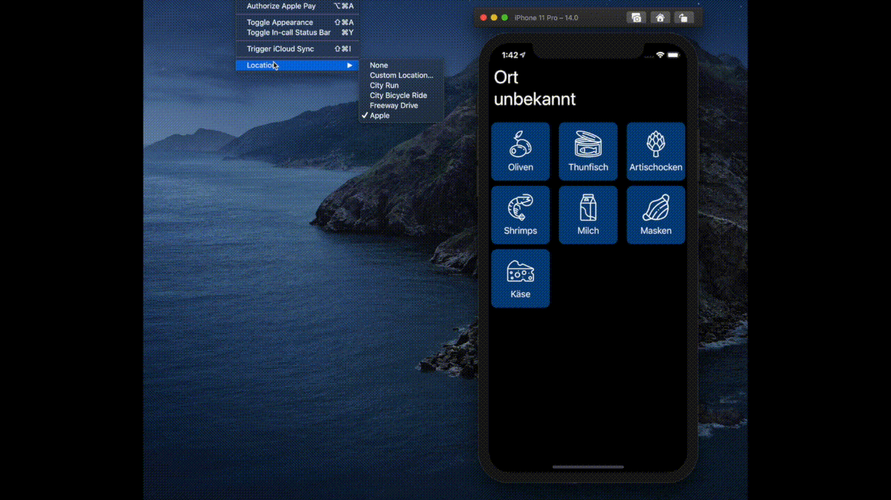

## What is SmartCart?

SmartCart is a PoC for sorting a shopping list by location based data and your shopping behaviour.
 
_**Problem:**_ For example, if you visit your favourite grocery store with your full packed shopping list you will maybe first find the vegetables but your unsorted list begins with toiletpaper. So what you do is scrolling the list down to the vegetables that you wanna buy or in the worst case you go to the toiletpaper and go 3 corridors back again.

_**Solution:**_ With SmartCart you can add the stores by their geolocation to the shopping list and if you enter the store your shopping list gets sorted by the order you went through the last time.

### What works and what not
- [x] Geofencing for a defined store
- [x] Store based sorting
- [ ] UI to add stores  
- [ ] UI to add items
- [ ] UI to create shopping lists

### How it currently looks like

